# BlockBlast RL Agent

Agent inteligent pentru un joc de tip **Block Blast**, antrenat prin invatare prin recompensa. Proiectul contine motorul jocului, mediu Gymnasium, PPO cu action masking, extractoare CNN, euristica de referinta, antrenare cu TensorBoard si o interfata vizuala pentru prezentare.

Ideea principala: agentul primeste tabla, cele trei piese disponibile si masca mutarilor valide, apoi alege piesa si pozitia. Scopul este sa supravietuiasca cat mai multe etape si sa elimine cat mai multe linii.

## Demo Rapid

```bash
python3 -m venv venv
source venv/bin/activate
python -m pip install -r requirements-torch-cpu.txt
python -m pip install -r requirements.txt
python watch.py
```

`watch.py` porneste cu modelul 8x8 inclus in repository. Daca vrei sa rulezi fara model PPO, doar cu euristica si mod manual:

```bash
python watch.py --no-model
```

Model explicit 8x8:

```bash
python watch.py \
  --board-size 8 \
  --model-path checkpoints/cnn_contact_threshold/basecnn_contact_threshold_gamma06_lr8e4_lines28/block_blast_basecnn_contact_threshold_gamma06_v1.zip
```

Model explicit 4x4:

```bash
python watch.py \
  --board-size 4 \
  --model-path checkpoints/4x4_best8x8/4x4_best8x8_basecnn_g03_lr2e3/block_blast_4x4_best8x8_basecnn_v1.zip
```

## Capturi Din Rulare

| Meniu principal | Agent PPO 8x8 | Euristica |
| --- | --- | --- |
| 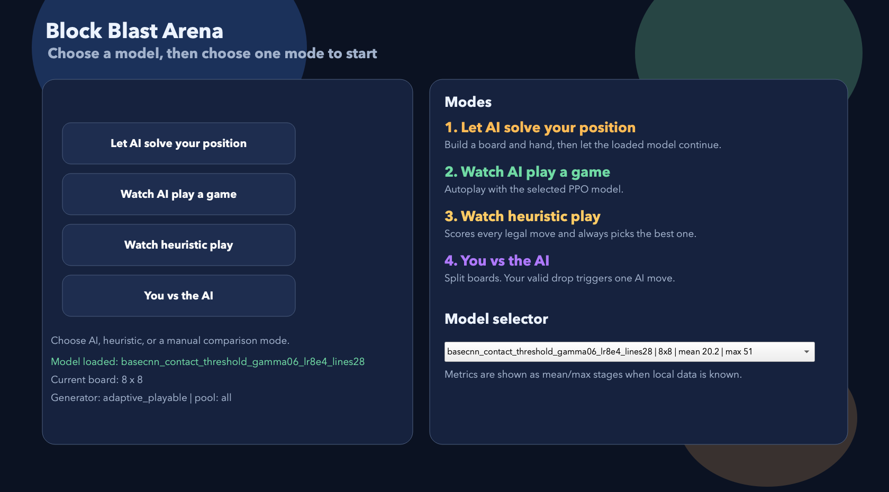 | 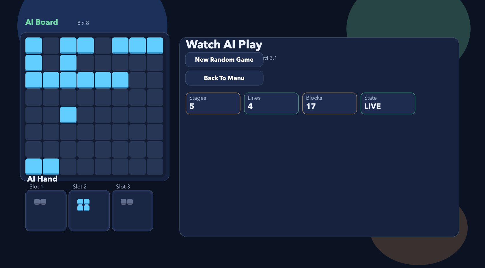 | 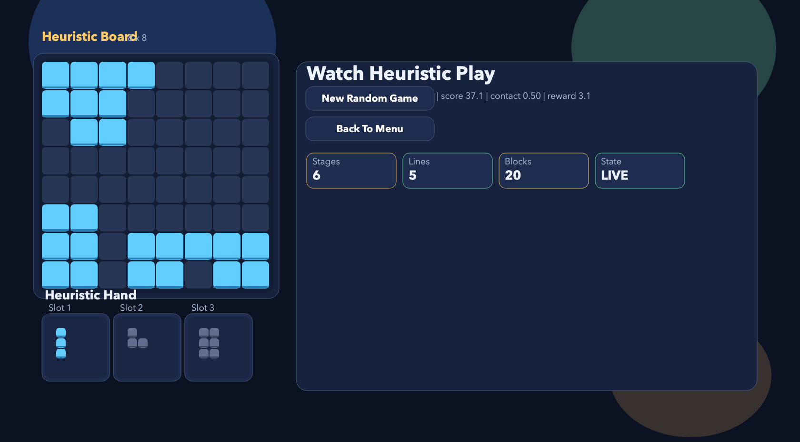 |

| You vs AI |
| --- |
| 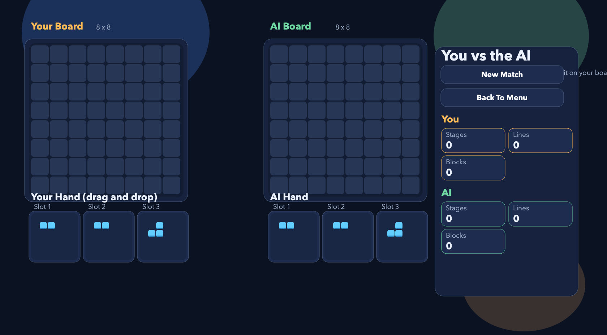 |

## Documentatie PDF

Raportul final este in [docs/report/main.pdf](docs/report/main.pdf). Sursa LaTeX este in [docs/report/main.tex](docs/report/main.tex), iar ghidul scurt pentru repetat prezentarea este in [docs/presentation/SUSTINERE_PROIECT.md](docs/presentation/SUSTINERE_PROIECT.md).

| Coperta raportului | Arhitectura din raport |
| --- | --- |
| 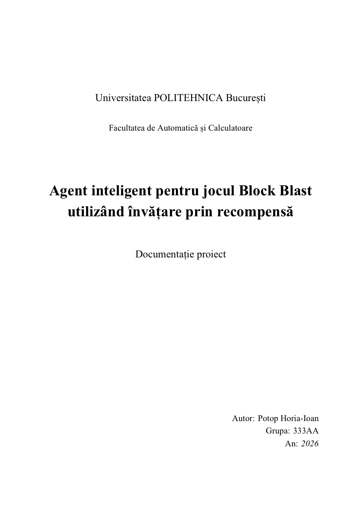 | 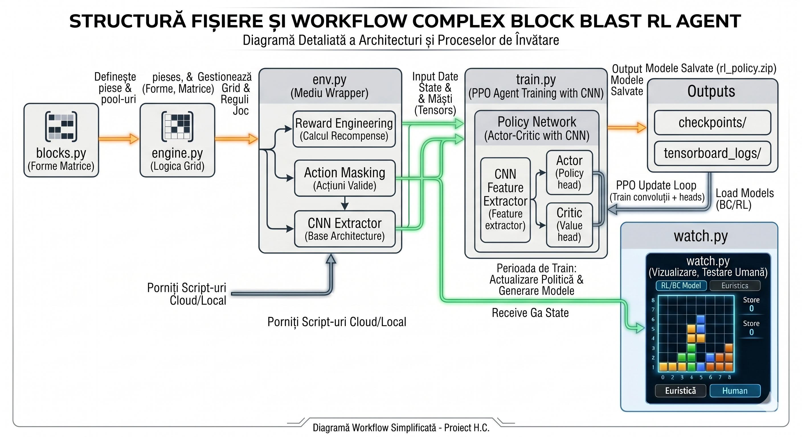 |

## Ce S-a Facut

Proiectul nu este doar un model antrenat, ci un pipeline complet:

1. Am definit piesele jocului ca matrice binare in `blocks.py`.
2. Am construit motorul jocului in `engine.py`: tabla, plasari valide, stergere de linii/coloane, final de joc, generare de maini.
3. Am transformat jocul intr-un mediu Gymnasium in `env.py`.
4. Am folosit `MaskablePPO` din `sb3-contrib`, ca modelul sa aleaga doar actiuni valide.
5. Am testat mai multe reward-uri: linii eliminate, contact, penalizari pentru gauri, penalizare de game over.
6. Am construit extractoare CNN pentru tabla si harta actiunilor valide.
7. Am adaugat `train.py` pentru antrenare, checkpoint-uri si TensorBoard.
8. Am adaugat `watch.py` pentru testare vizuala: AI, euristica, jucator vs AI si editor de pozitii.
9. Am testat si behavioral cloning, unde euristica este folosita ca profesor.

## Structura Proiectului

```text
.
|-- blocks.py                         # formele pieselor si pool-urile de training
|-- engine.py                         # regulile jocului, fara machine learning
|-- env.py                            # mediu Gymnasium, reward-uri, action mask, CNN-uri
|-- train.py                          # antrenare PPO, evaluare, checkpoint-uri, TensorBoard
|-- watch.py                          # interfata vizuala pentru demo si testare
|-- behavioral_cloning.py             # colectare date euristice si pre-antrenare supervizata
|-- checkpoints/                      # cateva modele demo/reprezentative
|-- scripts/                          # comenzi lungi pentru experimente importante
|-- docs/
|   |-- readme/                       # capturi folosite in README
|   |-- report/                       # raport PDF, LaTeX si figuri
|   |-- presentation/                 # ghid scurt pentru sustinere
|   `-- submission/                   # fisier de predare/arhivare
|-- requirements.txt
|-- requirements-torch-cpu.txt
`-- README.md
```

Folderele generate local raman ignorate de Git: `venv/`, `tensorboard_logs/`, `tensorboard_sweeps/`, `datasets/`, `run_logs/`, `sweep_results/` si majoritatea checkpoint-urilor noi.

## Cum Functioneaza Aplicatia

Fluxul simplificat este:

```text
blocks.py -> engine.py -> env.py -> train.py -> checkpoints + TensorBoard
                                      |
                                      v
                                  watch.py
```

`blocks.py` contine biblioteca de piese. Fiecare piesa este o matrice cu 0 si 1.

`engine.py` este partea determinista: verifica daca o piesa incape, o pune pe tabla, sterge liniile si coloanele complete si genereaza urmatoarea mana.

`env.py` face legatura cu reinforcement learning. Observatia primita de model are:

- `board`: tabla curenta;
- `valid_actions`: harta actiunilor valide pentru fiecare slot de piesa;
- `hand`: cele trei piese disponibile;
- `available`: sloturile care mai pot fi folosite in mana curenta.

Actiunea este codificata asa:

```text
actiune = index_piesa * board_size * board_size + rand * board_size + coloana
```

Pentru 8x8 exista `3 * 8 * 8 = 192` actiuni posibile. Pentru 4x4 exista `3 * 4 * 4 = 48` actiuni posibile. Action masking elimina actiunile imposibile inainte ca PPO sa aleaga mutarea.

## Functionalitati In `watch.py`

Interfata vizuala este partea cea mai buna pentru prezentare, pentru ca arata comportamentul modelului, nu doar metrici.

- **Let AI solve your position**: construiesti manual tabla si piesele, apoi agentul continua din pozitia aleasa.
- **Watch AI play a game**: modelul PPO joaca automat pe o partida generata.
- **Watch heuristic play**: euristica joaca automat si poate fi comparata cu PPO.
- **You vs the AI**: doua table in paralel; tu muti pe tabla ta, iar AI-ul raspunde pe tabla lui.

Pentru prezentare, recomand sa pornesti cu:

```bash
python watch.py
```

Apoi arata in ordine: meniul, `Watch AI play`, `Watch heuristic play`, `You vs the AI`, iar la final `Let AI solve your position`.

## Modele Incluse

Modelele utile pentru demo sunt:

```text
checkpoints/cnn_contact_threshold/basecnn_contact_threshold_gamma06_lr8e4_lines28/block_blast_basecnn_contact_threshold_gamma06_v1.zip
checkpoints/4x4_best8x8/4x4_best8x8_basecnn_g03_lr2e3/block_blast_4x4_best8x8_basecnn_v1.zip
```

Primul este modelul principal 8x8 folosit implicit in `watch.py`. Al doilea este modelul 4x4 folosit pentru comparatia cu spatiu de actiuni mai mic si FPS mai mare.

## Antrenare

Rulare scurta de verificare, utila ca sa vezi ca pipeline-ul merge:

```bash
python train.py \
  --board-size 8 \
  --vec-env dummy \
  --num-cpu 1 \
  --total-timesteps 2048 \
  --n-steps 64 \
  --batch-size 64 \
  --n-epochs 1 \
  --shape-pool mini \
  --hand-generator adaptive_playable \
  --model-path /tmp/blockblast_smoke_model \
  --log-dir /tmp/blockblast_tensorboard \
  --checkpoint-dir /tmp/blockblast_checkpoints \
  --eval-freq 0 \
  --no-resume
```

Rulare reprezentativa 8x8 cu recompensa de contact si linii:

```bash
bash scripts/run_basecnn_contact_threshold_gamma06.sh
```

Rulare reprezentativa 4x4:

```bash
bash scripts/run_4x4_best8x8_basecnn.sh
```

Reluarea unui model existent:

```bash
python train.py --resume --model-path checkpoints/cnn/demo_model
```

Initializarea unui model nou din greutatile altui model:

```bash
python train.py \
  --no-resume \
  --init-from-model checkpoints/cnn_contact_threshold/basecnn_contact_threshold_gamma06_lr8e4_lines28/block_blast_basecnn_contact_threshold_gamma06_v1 \
  --model-path checkpoints/cnn/new_finetune_model
```

## TensorBoard

TensorBoard se porneste dupa ce exista loguri generate local:

```bash
tensorboard --logdir tensorboard_logs
```

Pentru sweep-uri:

```bash
tensorboard --logdir tensorboard_sweeps
```

Metrici importante:

- `rollout/ep_len_mean`: lungimea medie a episoadelor in timpul colectarii PPO;
- `rollout/ep_rew_mean`: recompensa medie din rollout;
- `eval_stages/mean`: performanta medie in episoade de evaluare separate;
- `eval_stages/max`: cel mai bun episod din evaluare;
- `game_stats/Etape_Supravietuite`: cate etape a supravietuit agentul;
- `game_stats/Linii_Distruse`: cate linii/coloane a eliminat;
- `game_stats/Blocuri_Puse`: cate piese a plasat;
- `step_stats/reward_contact`: contributia recompensei pentru contact;
- `step_stats/reward_line`: contributia recompensei pentru linii;
- `time/fps`: viteza de training.

## Grafice TensorBoard Explicate

### Primele Familii De Modele

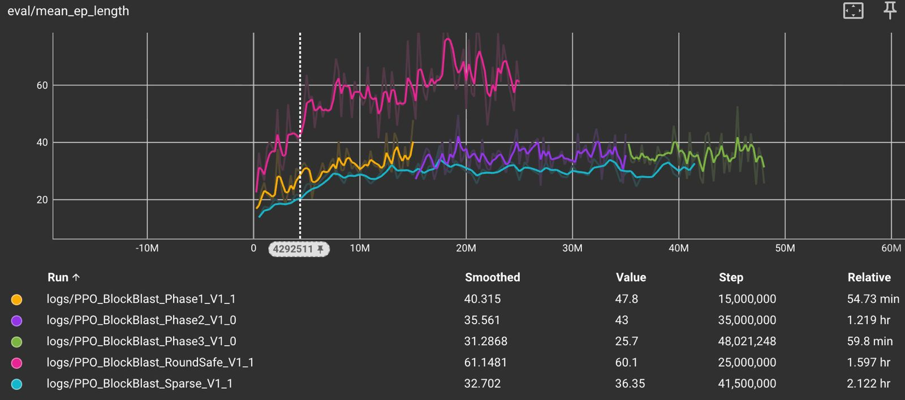

Acest grafic urmareste `eval/mean_ep_length`, adica durata medie a episoadelor in evaluare. Curba care creste mai sus arata un model care supravietuieste mai mult. Diferenta dintre rulari a aratat ca generatorul de piese influenteaza masiv dificultatea.

### Evaluari Periodice Pentru Modele Ulterioare

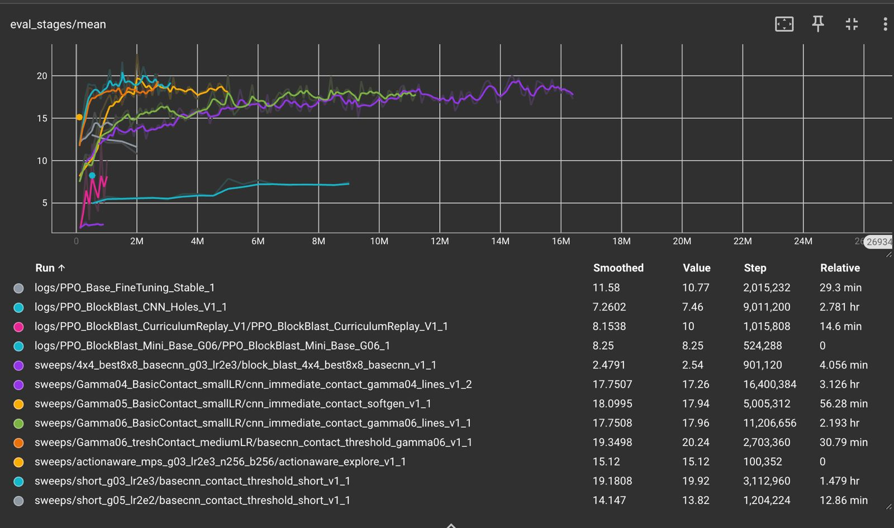

Acest grafic compara mai multe familii de modele pe `eval_stages/mean`. Evaluarea este separata de rollout, deci arata cat de bine joaca modelul in episoade de test. Aici se vad comparatii intre valori de `gamma`, learning rate, recompensa de contact, variante CNN si experimentul 4x4.

### Metrici De Joc

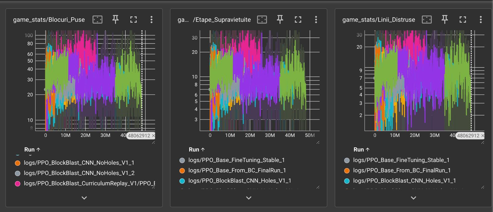

Cele trei panouri urmaresc cate blocuri sunt puse, cate etape sunt supravietuite si cate linii sunt distruse. Sunt zgomotoase pentru ca jocul depinde de piese generate procedural, dar sunt utile pentru a vedea daca modelul chiar joaca mai mult sau doar primeste recompensa pe termen scurt.

### Rollout PPO

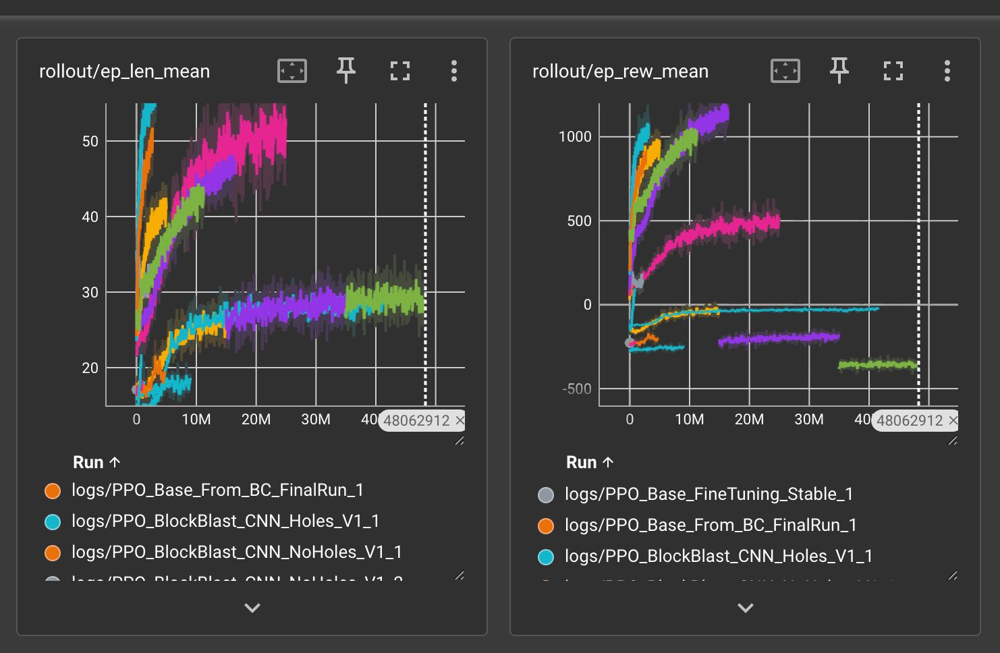

`rollout/ep_len_mean` arata lungimea episoadelor pe datele colectate pentru update-urile PPO. `rollout/ep_rew_mean` arata recompensa medie. Daca recompensa creste dar evaluarea nu creste, modelul poate exploata reward-ul fara sa devina mai bun in joc.

### Behavioral Cloning

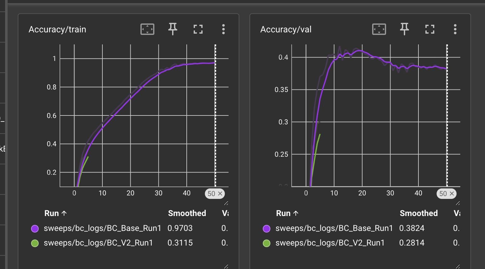

Graficul compara acuratetea pe train si validare pentru invatarea din euristica. Train urca mult, dar validarea ramane mult mai jos, ceea ce indica overfitting: modelul imita bine exemplele vazute, dar generalizeaza slab pe stari noi.

### Loguri In Terminal

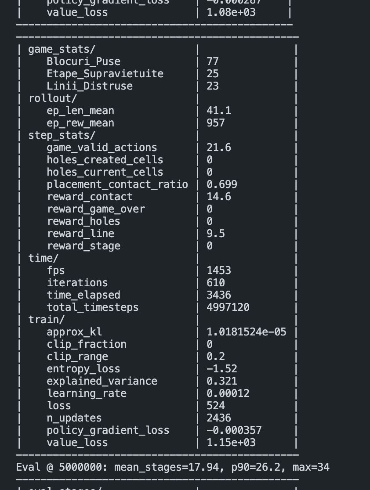

Terminalul confirma configuratia rularii: path-ul modelului, FPS, total timesteps, reward-uri, metrici PPO si evaluari periodice. Este util la prezentare ca dovada ca training-ul produce loguri reale si checkpoint-uri.

## Behavioral Cloning

Colectare de date de la euristica si pre-antrenare:

```bash
python scripts/run_behavioral_cloning.py \
  --mode all \
  --board-size 8 \
  --num-episodes 500 \
  --shape-pool all \
  --hand-generator adaptive_playable
```

Ideea este ca euristica alege mutari bune, iar modelul incearca sa le imite. In experimente, acuratetea pe train a crescut mult, dar validarea a ramas mai slaba, deci directia e utila dar necesita mai multe date si o strategie mai buna de generalizare.

## Cum Prezint Proiectul In Clasa

O ordine simpla de prezentare:

1. **Problema**: Block Blast este un joc de plasare de piese, cu decizii secventiale si blocaje geometrice.
2. **Modelarea RL**: starea este tabla plus piesele, actiunea este piesa plus pozitia, recompensa vine din linii, contact si supravietuire.
3. **Action masking**: agentul nu poate alege mutari imposibile, deci invata din mutari legale.
4. **Arhitectura**: `blocks.py`, `engine.py`, `env.py`, `train.py`, `watch.py`.
5. **Demo live**: rulezi `python watch.py` si arati modurile principale.
6. **TensorBoard**: explici ca ai comparat rulari prin evaluari, rollout, metrici de joc si acuratete BC.
7. **Concluzie**: recompensa de contact si generatorul adaptiv au fost importante; 4x4 este mai rapid, dar nu neaparat mai usor; behavioral cloning are potential, dar a facut overfitting.

Intrebari probabile:

- **De ce PPO?** Este stabil pentru politici stocastice si se potriveste bine cu `MaskablePPO`.
- **De ce CNN?** Tabla este spatiala, iar vecinatatile conteaza: linii, margini, goluri, contact.
- **De ce action masking?** Fara masca, multe actiuni ar fi imposibile si training-ul ar irosi timp.
- **Ce a mers cel mai bine?** Model 8x8 cu generator adaptiv, recompensa de contact si recompensa pentru linii.
- **Ce nu a mers perfect?** Penalizarea pentru gauri si behavioral cloning-ul au fost mai greu de generalizat.

## Checklist Pentru Push

Inainte de push:

```bash
git status --short
python -m compileall blocks.py engine.py env.py train.py watch.py behavioral_cloning.py scripts/run_behavioral_cloning.py
python watch.py
```

Nu se urca `venv/`, logurile TensorBoard locale sau dataset-urile generate. README-ul contine deja capturi si explicatii pentru prezentare.
